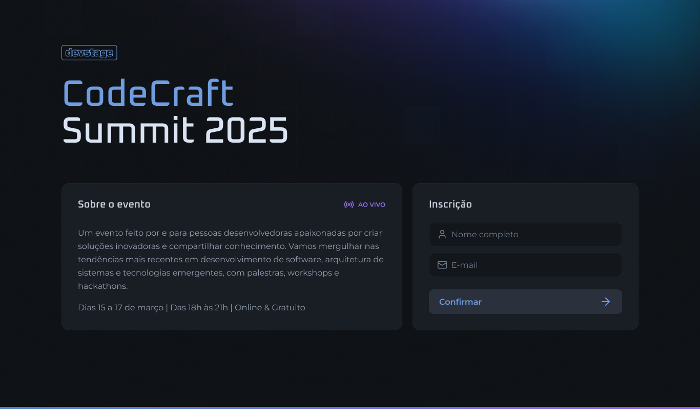
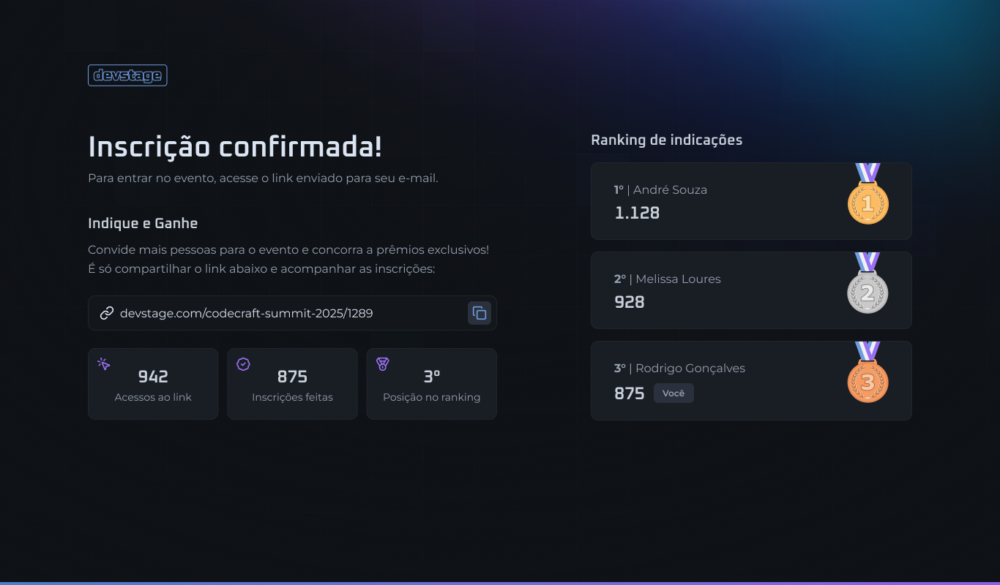
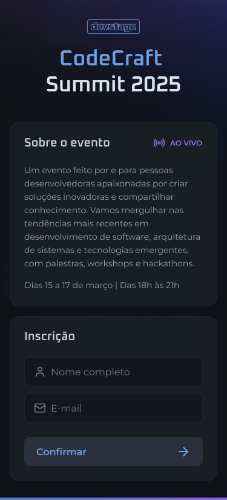
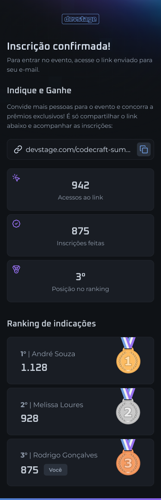

# Projeto FrontEnd do NLW Conect da RocketSeat - 2025
Projeto da semana NLW Conect da RocketSeat, sendo a trilha de React a escolhida por mim, onde o objetivo é criar uma aplicação de cadastro e indicações, via link de indicação, onde foram usadas várias tecnologias atualmente utilizadas.

O Projeto foi adaptado para não utilizar a API, portanto ele não está 100% funcional, apenas com a parte do FrontEnd Funcionando.
## Tecnologias 
- ### NextJS/TS
  - Utilizado NextJs para facilitar a utilização de Rotas e utilizar a opção de SSR para alguns componentes especificos.
- ### Orval 
  - Para implementar as requisições automaticamente via JSON da doc Swagger, disponibilizado pelo backend.
- ### Git/Github
  - Git para o versionamento.
  - Github para um repositório para o projeto.
- ### Lucid Icons
  - Lib de icones utilizada no projeto.
- ### React Hook Forms / Zod
  - React Hook Forms para facilitar a criação de formulários.
  - Zod para as validações necessárias do formulário.
- ### TailwindCss
  - Para a estilização, utilizando Mobile First.

# Preview
- ## Desktop

- ## Mobile

